# 基于大数据分析技术的游客感知系统的设计与实现

> 公开脱敏版：保留论文正文与技术插图；学校模板、页眉页脚、校徽、身份元数据不进入公开文件，含个人资料或凭据的截图已隐藏。

目  录

## 绪论

研究背景和意义

随着全球旅游业的快速发展，旅游目的地的竞争日益激烈，游客感知成为塑造景区形象和吸引游客的重要因素。都江堰，作为中国历史悠久的旅游胜地之一，吸引了大量游客。在这一背景下，本研究选取都江堰景区为研究对象，以大数据分析技术为手段，深入挖掘游客对景区的感知，旨在为提升景区整体形象和服务水平提供科学有效的策略。

首先，通过Python爬虫技术搜集网络上关于都江堰的游客评论数据，为大数据分析提供了丰富的原始材料。这些评论反映了游客的真实感受和期望，是理解游客需求的珍贵资源。通过情感分析、主题提取和关键词挖掘等技术，能够深入剖析评论文本，揭示游客对景区的好恶、关注点和期望。

其次，构建感知指标体系，包括景区服务质量、环境优美程度、旅游资源丰富程度等方面的评价指标，通过定量分析计算每个指标的得分，综合评估游客对都江堰景区的感知水平。这为景区管理者提供了全面、客观的数据支持，有助于精准把握景区的优势和不足。

最后，通过将游客感知与其他数据（如游客流量和收入数据）相结合，探讨游客感知与景区经济效益的关系，为景区运营和市场策略提供战略性建议。这一研究不仅有助于都江堰景区提升自身竞争力，也为其他旅游目的地运用大数据分析技术进行感知研究提供了有益经验。

国内外研究现状

国内外关于旅游目的地感知的研究日益受到学者和业界的关注。在国外，许多学者采用大数据分析技术，通过挖掘社交媒体和在线评论等数据，深入了解游客对景区的感知。例如，美国的一些研究关注游客在TripAdvisor等旅游网站上的评论，通过情感分析和主题提取，揭示了景区服务和设施的优势与不足。这些研究为提升旅游目的地的品牌形象和游客体验提供了实证支持。

国内学者对大数据分析都有着众多研究，史伟,薛广聪,何绍义就情感分析进行了研究，基于情感视角对国内外网络舆情的研究进展和发展趋势进行分析，旨在帮助相关领域学者了解其研究热点和发展方向，为未来进一步的拓展研究提供理论支持和参考[1]。李星辉等也提出基于流计算框架实时捕捉和预处理数据，包括采用Flink的transform算子对数据进行校验和处理，将处理后的数据sink到大数据的HDFS文件系统，交由下一步的大数据并行框架进行分析建模与训练，实现基于流计算和大数据平台的实时交通流预测[2]，侯娅也提出了医疗大数据分析与人工智能（AI）技术在卫生系统中的应用正迅速改变着现代医疗的面貌，推动了医疗卫生水平的不断提高[3]的概念，刘方磊也实现了用国产开发生态替代传统开发生态,推动旅游系统升级和数字化转型的旅游数据分析系统[4]，王娜也基于大数据实现了一款系统，来帮助研究人员从事故数据中挖掘出潜在的规律和特征[5]，程君探论了基于大数据的职业教育数据管理体系架构的应用，包括管理平台总体架构、系统标准管理、数据采集及清洗、数据质量管理，分析数据的可靠性、一致性、合规程度及访问有效性，从而确保数据能够合理应用于教学流程的规范、教学策略的规划、教学质量的提升[6]，赵寒影也研究了“互联网+”已成为大众旅游新场景、智慧旅游新动能。河南省旅游资源丰富、人口众多，旅游市场消费潜力大，旅游业的发展对于全省的经济发展有着至关重要的影响。现以河南省旅游业为研究对象，基于4P营销理论、4C理论以及互联网营销理论的框架，分析河南省旅游业发展策略的实施现状及问题[7]，薛丹发出了大数据时代的来临改变了旅游业的发展趋势，作为全面推进乡村振兴、发展乡村经济的重要手段，乡村旅游业在发展过程中必然要合理利用大数据技术。在深入调查和分析黑龙江省应用大数据发展乡村旅游业的成效基础上，对黑龙江省应用大数据推进乡村旅游发展过程中出现的问题进行了深入思考[8]，马志芹也发表了旅游景区作为劳动密集型企业，是旅游产品供给的重要窗口，其人力成本占据景区整体运营成本的较大比重。在大数据背景下，文章通过对多元化平台上的人力成本结构数据进行综合分析，结合南京市旅游景区的实证调查，对南京市旅游景区人力成本结构现状展开了研究。研究发现南京市旅游景区在运营过程中存在人力成本较低、差异大、岗位层次少等问题，并针对性地提出了优化策略建议，以期为南京市旅游景区的高效发展提供助力[9]，段锐主要通过自然语言处理技术对文本进行分析，深度学习技术逐渐应用于图片和视频数据分析领域；工具上，主要使用带有图形用户界面的数据分析软件进行分析以及通过编程调用平台或模块开展研究[10]。

国外方面，Jing Qin基于大数据算法，对SVM模型进行了详细描述，利用GWO算法优化了SVM的算法流程，构建了GWO-SVM分类模型。将GWO-SVM用于旅游景区规划开发的形象感知数据挖掘分析，并以某城市旅游景区为例，挖掘了影响形象感知的三个因素，即形象感知属性、情感形象和探索变量[11]。Li Jing 通过查阅、归纳、分析大量关于旅游消费行为、旅游大数据、文本数据分析等方面的相关文献研究，构建了旅游消费的研究思路框架。利用火车浏览器、NLPIR等软件对旅游样本数据进行抓取、预处理和挖掘，采用词频分析、共现分析、内容分析、情感分析、网络分析等方法对游客的特征和决策行为进行分析。根据行为分析结果，从改革和推进旅游营销策略、提高旅游产品和服务质量、改进旅游目的地管理方法三个方面提出了旅游发展策略[12]。Su Aihua提出国家旅游业竞争十分激烈。大数据的出现为旅游业的发展提供了新的机遇。旅游业利用数据挖掘和云计算技术，从海量信息中筛选出有价值的数据[13]。

研究内容

本研究的主要内容涵盖了多个关键技术和领域，旨在构建一个基于Python、Flask、Vue和MySQL的综合系统，以深入研究都江堰景区游客感知及优化策略。

首先，通过Python编程语言实现网络爬虫，从各大旅游网站收集都江堰景区的游客评论数据。这为后续分析提供了丰富的原始材料，使得研究能够基于真实游客的观点深入了解景区的优势和不足。

其次，采用Flask框架构建后端服务，通过该服务实现对收集的评论数据的处理和分析。情感分析、主题提取和关键词挖掘等自然语言处理技术将被应用，以挖掘游客对都江堰景区的情感和关注点。

同时，利用Vue框架搭建前端界面，实现对分析结果的可视化呈现。通过直观的图表和界面，使景区管理者能够清晰地了解游客的整体感知以及不同方面的关切。

最后，利用MySQL数据库存储分析过程中产生的数据，以及感知指标体系的构建和优化过程中的各类信息。这将为系统提供高效、可扩展的数据管理和查询功能。

综合而言，本研究通过整合Python、Flask、Vue和MySQL等技术，实现了一个全面、多层次的游客感知研究系统，为都江堰景区提升管理水平和服务品质提供了深度分析的支持。

本文内容安排

本节主要介绍该论文一个整体流程，总共分为六章如下。

## 第一章：对本系统开发的背景、系统开发意义、对系统国内外环境进行分析、以及系统开发出来起到了什么作用；

## 第二章：对系统关键技术进行了相应的介绍，从技术框架、持久层框架、以及交互框架都进行相应介绍；

## 第三章：对本系统需求进行了分析、项目可行性分析、以及对系统性能需求进行了相应的分析；

第四章：对系统整个架构方面进行了描述，功能模块进行了相应的细分与描述、系统数据库的分析以及主要数据库表的展示，对系统功能进行介绍，用简易的文字描述与实现图片在对整个功能流程进行大概实现过程进行介绍；

## 第五章：为了了解系统功能是否完善，性能是否能够跟的上设计了相应的测试计划，通过测试反应数据在进行系统的优化；

文章最后进行了整个论文的总结，以及自己在制作系统过程中的一些收获，对自己未来的启示，以及对系统未来发展的展望。

## 关键技术介绍

服务端技术

Python

Python 是一种高级、动态类型的编程语言，自从 1991 年首次发布以来，已经成为全球范围内广泛应用的编程语言之一。Python 的特点包括简洁、易读、可扩展性强，以及拥有庞大的开源社区。这些优势使得 Python 成为了开发网络安全检测系统的理想选择。

Python 语法简洁、易读，有助于提高开发效率，降低维护成本。这种简洁性使得 Python 代码更容易理解和修改，对于开发网络安全检测系统这样需要频繁更新和维护的项目而言，Python 的易用性大大提高了开发效率。

Python 拥有强大的标准库和丰富的第三方库，这些库为开发者提供了许多现成的功能和工具，可以大大减少开发工作量。在网络安全领域，Python 社区已经为开发者提供了大量的安全相关库，如 Requests、BeautifulSoup、Scrapy 等用于网络爬虫，Nmap、Scapy 等用于网络扫描，以及 Django、Flask 等 Web 框架。这些库简化了网络安全检测系统的开发过程，为开发者提供了丰富的资源。

MySQL数据库

MySQL AB是一家基于MySQL开发人员的商业公司，它是一家使用了一种成功的商业模式来结合开源价值和方法论的第二代开源公司。MySQL是MySQL AB的注册商标。MySQL的SQL“结构化查询语言”。SQL是用于访问数据库的最常用标准化语言。MySQL软件采用了GPL（GNU通用公共许可证）。由于其体积小、速度快、总体拥有成本低，尤其是开放源码这一特点，许多中小型网站为了降低网站总体拥有成本而选择了MySQL作为网站数据库。

MySQL是一个快速的、多线程、多用户和健壮的SQL数据库服务器。MySQL服务器支持关键任务、重负载生产系统的使用，也可以将它嵌入到一个大配置(mass-deployed)的软件中去。

Flask

Flask 是一个轻量级的 Python Web 框架，采用简单而灵活的设计理念。其核心特点包括使用 Jinja2 模板引擎进行 HTML 页面渲染，通过装饰器定义简洁清晰的路由，提供了内置的开发服务器方便测试，基于 Werkzeug WSGI 工具箱实现与 WSGI 兼容的服务器集成。Flask 还支持丰富的扩展机制，可以方便地集成数据库、表单处理、用户认证等功能。由于其简洁性和可定制性，Flask 成为开发小型到中型 Web 应用的理想选择，同时也是学习 Python Web 开发的良好入门框架。

前端技术

Vue

Vue.js 是一款轻量级、高效且易于上手的 JavaScript 框架，用于构建用户界面和单页面应用。Vue 的核心特性包括声明式渲染、组件化、响应式数据绑定和虚拟 DOM，使得开发者能够更高效地构建可维护和可扩展的 Web 应用。Vue.js 支持插件系统和周边生态，例如 Vuex（状态管理）和 Vue Router（路由管理），进一步提升了其在复杂项目中的实用性。

Echarts

ECharts是一个开源的可视化库，用于创建交互式和可定制的数据可视化图表。它基于纯JavaScript，提供了丰富的图表类型，包括折线图、柱状图、饼图、散点图等，适用于各种数据展示需求。ECharts支持响应式设计，可在不同设备上无缝展示图表，并提供强大的交互功能，如数据缩放、拖拽、图例切换等。ECharts还提供了多语言支持和插件扩展机制，使开发者能够轻松创建出美观、交互丰富的数据可视化应用。无论是数据分析、数据报告还是数据监控，ECharts都是一个强大的工具。

## 系统分析

可行性分析

系统可行性分析是一个综合性的评估过程，涉及技术、经济和法律等多个方面。以下是对这三个方面进行的可行性分析：

1.技术可行性：

数据采集技术：使用Python编程语言和网络爬虫技术实现数据的快速、准确的采集，这在当前技术水平下是可行的。

分析技术：利用自然语言处理、情感分析等技术对评论文本进行深度分析，这些技术在大数据领域已经得到广泛应用，具备可行性。

框架和库的选择：使用Flask和Vue构建前后端，MySQL作为数据库，这些工具和框架在Web开发中具有广泛应用，技术选型是可行的。

2. 经济可行性：

成本分析： 系统开发和维护的成本相对较低，开源工具的使用减少了软件和硬件成本。

收益预测： 通过提升景区管理水平和服务品质，吸引更多游客，从而提升景区的经济效益，有望带来可观的经济收益。

3. 法律可行性：

隐私和数据安全： 需要确保在数据采集和存储过程中遵守相关法规，尤其是用户隐私保护的法律法规，以保证系统的合法性。

知识产权： 确保在开发中遵守相关的知识产权法律，如使用开源工具时需遵循相应的开源协议。

综合来看，从技术、经济和法律三个方面进行的可行性分析显示，构建基于Python、Flask、Vue和MySQL的系统在当前条件下是可行的，有望为都江堰景区提升管理水平和服务品质提供有效支持。

系统需求分析

功能需求分析

本系统旨在深入理解都江堰景区管理的实际业务需求。通过采集游客评论数据，系统将实现对景区服务的综合评估，包括服务质量、环境优美度、旅游资源丰富度等方面。情感分析和关键词挖掘将揭示游客的偏好和关注点。通过构建感知指标体系，可实现对景区整体感知水平的定量分析。系统将为景区提供深刻的管理洞察，帮助发现潜在问题和优势。最终，通过与其他数据（如游客流量、收入）比较，系统将为景区提供有针对性的优化建议，提升游客体验和景区经济效益。这一系统旨在实现精准管理，促使都江堰景区更好地满足游客需求，提高整体竞争力。

通过对业务需求的拆分，可以得知本系统共有几个功能：数据爬取，数据分析，机器学习，分析结果展示，系统登录，因此本系统的用例图如图3-1所示。

图3-1 用例图

数据爬取用例主要分为三类：旅游景点信息、用户评论和团购信息。通过对携程网上都江堰相关数据的观察，发现最具有代表性的数据包括都江堰旅游景区介绍、用户对各大景点的评论以及携程网上商家针对都江堰景区的旅游套餐信息。这些数据将提供更全面的了解都江堰目前的旅游现状和市场走向，用例描述如表3-1所示。

表3-1 数据爬取

<table>
<tr><td>名称</td><td colspan="2">数据爬取</td></tr>
<tr><td>概述</td><td colspan="2">爬取携程网上有关都江堰景区，旅游套餐，用户评价等信息</td></tr>
<tr><td>参与者</td><td colspan="2">Python爬取程序</td></tr>
<tr><td>前置条件</td><td colspan="2">可以连接互联网的PC</td></tr>
<tr><td>基本事件流</td><td>步骤</td><td>活动</td></tr>
<tr><td></td><td>1</td><td>启动Python爬取程序</td></tr>
<tr><td></td><td>2</td><td>程序连接到携程网并开始爬取都江堰景区相关信息</td></tr>
<tr><td></td><td>3</td><td>爬取携程网上都江堰景区的介绍和信息</td></tr>
<tr><td></td><td>4</td><td>爬取携程网上都江堰景区的旅游套餐信息</td></tr>
<tr><td></td><td>5</td><td>爬取用户对都江堰景区的评价信息</td></tr>
<tr><td></td><td>6</td><td>将爬取到的数据存入数据库中</td></tr>
</table>

系统中包含大量敏感数据，涵盖了携程用户的头像、昵称、照片等敏感信息。为了确保数据安全，系统采用登录验证机制，只有经过成功登录的用户才能访问爬取的数据和分析的结果。这举措有助于保护用户隐私及敏感信息的安全性，用例描述与表3-2所示。

表3-2 登录

<table>
<tr><td>名称</td><td colspan="2">登录</td></tr>
<tr><td>概述</td><td colspan="2">输入正确的账号与密码进入系统</td></tr>
<tr><td>参与者</td><td colspan="2">系统用户</td></tr>
<tr><td>前置条件</td><td colspan="2">数据库中有该登入用户的基本信息</td></tr>
<tr><td>基本事件流</td><td>步骤</td><td>活动</td></tr>
<tr><td></td><td>1</td><td>访问系统地址</td></tr>
<tr><td></td><td>2</td><td>检测是否登录，如果没有跳转登录界面，如果有直接进入首页</td></tr>
<tr><td></td><td>3</td><td>在登录界面中输入账号与密码</td></tr>
<tr><td></td><td>4</td><td>系统检验账号与密码的真实性</td></tr>
<tr><td></td><td>5</td><td>校验通过跳转首页，校验未通过，提示账号或密码</td></tr>
</table>

在数据分析用例中，首要步骤是对爬取得到的数据进行清洗，剔除无关紧要的信息，确保数据的准确性和可用性。随后，将进行多方面的深入分析：

客源分析： 利用用户评论数据中的时间戳和IP地址，进行客源分析，以揭示都江堰景区的客户来源信息，为制定相关营销策略提供依据。

偏好分析： 通过对用户评论数据进行关键词提取，探讨游客的旅游偏好，为个性化服务和产品推荐提供指导。

情感分析： 运用情感分析技术，深入挖掘用户对都江堰景区的态度和情感色彩，从而了解其满意度、期望和改进建议，为提升景区服务质量提供有力支持。

路线分析： 对商家提供的旅游套餐进行详尽分析，揭示市场对都江堰景区的看法和需求，为商家和相关从业者提供指导性建议。如表3-3所示。

表3-3 数据分析

<table>
<tr><td>名称</td><td colspan="2">数据分析</td></tr>
<tr><td>概述</td><td colspan="2">对清洗后的数据进行深入分析</td></tr>
<tr><td>参与者</td><td colspan="2">Python</td></tr>
<tr><td>前置条件</td><td colspan="2">数据爬取完成，清洗过程结束</td></tr>
<tr><td>基本事件流</td><td>步骤</td><td>活动</td></tr>
<tr><td></td><td>1</td><td>进行客源分析，利用评论时间戳和IP地址揭示景区客户来源信息</td></tr>
<tr><td></td><td>2</td><td>进行偏好分析，通过价格，出行人数，关键词等因素体现游客出行爱好</td></tr>
<tr><td></td><td>3</td><td>进行情感分析，探讨用户对景区的态度和情感色彩</td></tr>
<tr><td></td><td>4</td><td>进行路线分析，详尽分析商家提供的旅游套餐，揭示市场对景区的看法和需求</td></tr>
<tr><td></td><td>5</td><td>进行都江堰景区分析，分析用户对该景区的评价与看法</td></tr>
<tr><td></td><td>6</td><td>展示清洗后的原数据</td></tr>
</table>

非功能需求分析

为了保障数据处理速度、数据爬取效率，以及系统对携程网都江堰旅游的最新最热数据的及时收集，系统在性能上具有以下需求：

性能需求：

响应时间： 系统应能够在毫秒级别内对用户请求做出响应，确保用户体验流畅。

并发能力： 系统支持大量并发请求，以保证用户的访问不会受到限制，确保系统在高负载情况下依然能够高效运行。

数据处理速度： 系统能够实时处理大量的数据，以确保爬取到的携程网都江堰旅游数据及时更新，保持数据的实时性。

安全性需求：

用户数据保护： 系统需确保用户隐私数据的保密性和完整性，通过加密等手段保护用户的个人信息。

系统数据保护： 采用多种安全技术，如防火墙、入侵检测系统等，以预防系统被黑客攻击，保障系统数据的安全性。

合法合规爬取： 保证爬取的携程网都江堰旅游数据在法律的允许范围内进行，遵循相关法规和协议，确保合法爬取。

内容保护： 严格保护被爬取的内容，尊重携程网的规定和用户隐私，确保爬取的数据在合理范围内使用，不侵犯他人权益。

以上需求将有助于确保系统在性能和安全性方面能够达到用户和法规的期望，提供稳定、高效、安全的服务。

本章小结

在这一章节中，进行了系统需求的深入分析，明确了系统所追求的功能目标。通过对性能、安全性以及数据实时性的要求，确保系统在各个方面都能够满足用户和业务的期望。这一系列需求的明确定义将为系统的设计和开发提供坚实的基础，使得系统能够在实现目标的同时保持高效、安全和可靠。

## 系统设计

系统总体设计

在第三章的系统需求分析中，总结出本系统包含四大核心功能模块：数据爬取、登录、数据分析和机器学习。这些功能模块共同构建了系统的基本架构，以满足用户需求并实现系统设定的目标，系统功能结构图如图4-1所示。

图4-1 系统功能结构图

系统的整体架构采用了B/S架构，其中客户端是基于PC上的浏览器，而服务端则采用了Flask框架。系统的核心功能由爬虫和机器学习模块共同构成，为用户提供了丰富的服务。

在客户端，选择了Vue框架作为交互层的基础，以确保用户体验的流畅性和界面的友好性。通过Vue框架，用户可以方便地与系统进行交互，完成各项操作。

客户端与服务端之间的通信采用了HTTP协议，确保了信息的快速传递和系统的高效运行。服务端具备多项重要功能，包括用户登录验证、客源分析等。此外，服务端还支持对MySQL数据库的操作，为系统提供了可靠的数据存储和管理手段。

综合而言，该系统通过B/S架构、Flask框架、Vue框架以及HTTP通信等技术组件的有机结合，实现了稳定、高效、用户友好的特性，同时通过爬虫和机器学习模块为用户提供了强大的功能支持。服务端的数据库操作进一步增强了系统的数据管理能力，为用户提供了全面而可靠的服务，系统的架构图如图4-2所示。

图4-2 系统架构图

主要功能设计

登录

用户通过访问 /login 请求登录页面，向服务器发起请求，服务器接收到请求后，将其交给 login 函数处理，login 函数首先获取请求数据，判断请求方法是否为 GET，如果是 GET 并且用户的 session 中已经存在 userid，那么会调用 User().userinfo() 获取用户信息，并将其序列化为 JSON 格式返回给客户端，如果请求方法是 POST，那么将获取的数据传递给 User().valid_login() 函数进行登录验证，如果验证通过，则将用户信息存入 session 中，并将其序列化为 JSON 格式返回给客户端，否则返回错误信息。最后，将序列化后的数据返回给客户端，因此一个login函数解决了鉴权与登录判断，登录时序图如图4-3所示。

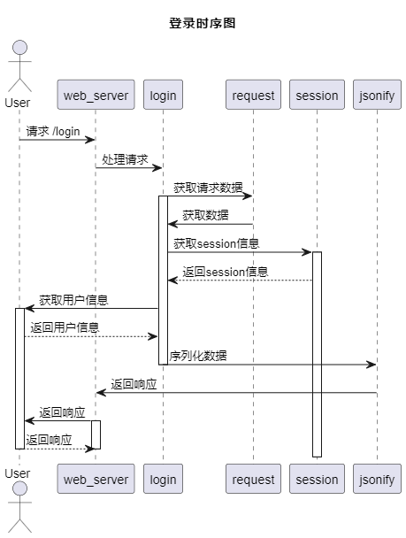

图4-3 登录时序图

数据爬取

观察携程网得知，都江堰地区的主要旅游景点包括熊猫苑、青城山、青城山后山、都江堰景区和熊猫繁育研究基地。在获取这些景点的基本介绍数据时，通过分析携程网返回的内容发现是HTML页面，因此使用了Python的BeautifulSoup框架。

在代码中，get_attraction_info函数用于提取给定cargetId的景点信息。该函数发送HTTP请求至对应的携程URL，解析HTML内容，并提取相关信息，如名称、评分、地址等。提取的数据随后存储在名为data的字典中。

main函数初始化一个包含不同cargetId值的列表，代表都江堰的不同景点。然后，通过创建多个线程并发执行get_attraction_info函数，实现了同时获取多个景点的详细信息。每个线程负责一个景点的信息提取。为避免对服务器造成过大压力，脚本在每个线程之间引入了10秒的延迟。

脚本使用MySQL数据库（engine）存储提取的数据。它使用pandas库将数据从data字典创建为DataFrame，然后将DataFrame写入数据库中，景点信息爬取时序图如图4-4所示。

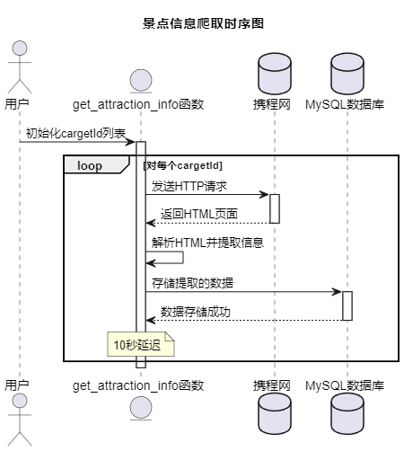

图4-4 景点信息爬取时序图

观察携程网得知，在每个景点信息页面中，评论数据的获取都来自接口：getCommentCollapseList，该接口有两个请求对象：arg对象与head对象，通过对页面的点击发现，head对象的内容是不变的，arg对象中的字段pageSize与pageIndex是用户评论分页字段，commentTagId字段为携程网自己的评论聚合字段，因此可以根据这个观察结果，使用Python的Requests库进行景点评论的获取。

爬虫部分使用多线程，通过 get_attIds 函数从数据库中获取所有的景点ID。在 main 函数中，对每个景点ID，都创建了一个线程池，并在其中提交了 20 个任务，每个任务对应一个页面的数据获取和保存。这是通过 executor.submit(fetch_data, str(attId), page) 实现的，获取数据：在 fetch_data 函数中，首先更新请求参数中的页面编号和景点ID，然后发送 POST 请求获取数据，处理数据：如果请求成功，处理返回的数据，将需要的信息保存到一个字典中，然后将所有字典添加到一个列表中。保存数据：将列表转换为 pandas DataFrame，然后尝试将 DataFrame 保存到数据库中，时序图如图4-5所示。

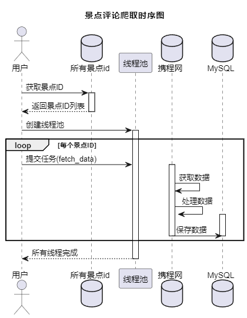

图4-5 景点评论爬取时序图

通过对携程网有关都江堰团购旅游路线的数据得知，与都江堰有关的数据都包含了其他路线，因此在爬取数据选择的过程中，尽量选择都江堰景区比例多的路线，然后在携程网上进行排序，选择销量优先的数据，然后将浏览器转为手机，获取携程网手机的url地址，直接采用Requests的方式获取数据。

首先创建了一个线程池，然后向线程池中提交了多个任务。每个任务都是一个 fetch_data 函数的调用，其中的参数 page 用于指定要抓取的页面。线程池会自动调度这些任务，并在多个线程中并发地执行它们。每个任务都会发送一个 API 请求，然后解析 API 数据，将数据转换为 DataFrame，并将数据保存到数据库中。如果保存成功，程序会打印保存成功信息；否则，程序会打印请求失败信息。当所有线程执行完毕后，主线程会结束程序，时序图如图4-6所示。

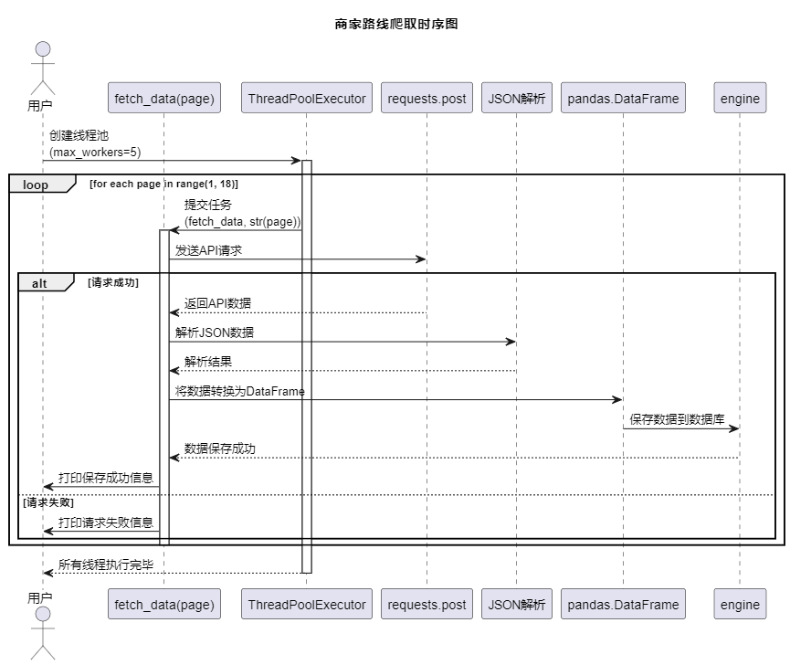

图4-6 商家路线爬取时序图

商家路线跟团游评论获取方式与景点评论获取方式类似，通过Requests访问评论获取接口，然后解析数据，时序图如图4-7所示。

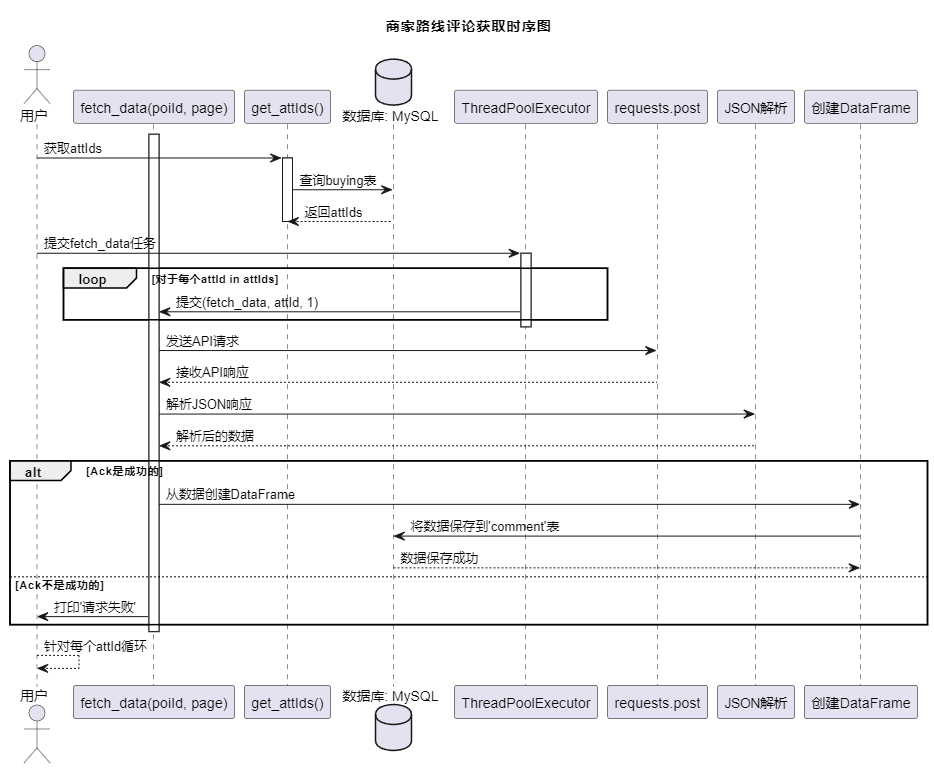

图4-7 商家路线评论数据爬取时序图

首先从数据库中获取attIds，然后向线程池中提交了多个任务。每个任务都是一个 fetch_data 函数的调用，其中的参数 poiId 和 page 用于指定要抓取的页面。线程池会自动调度这些任务，并在多个线程中并发地执行它们。每个任务都会发送一个 API 请求，然后解析 API 数据，将数据转换为 DataFrame，并将数据保存到数据库中。如果保存成功，程序会打印保存成功信息；否则，程序会打印请求失败信息。

商家路线分析设计

通过商家路线信息爬取得知，商家数据中主要包含了标题，得分等，其中得分可以直接展示游客对该旅游路线的满意度情况，也可以体现出游客对该景区的满意度情况，因此商家路线分析功能中，主要针对商家路线得分情况展开分析，首先，从数据库中获取所有不为空的商家信息数据，然后获取得分统计信息，计算3分和4分商家占总数比例，最后构建结果字典，通过此分析，可以帮助用户更加直观的了解有关都江堰景区的用户满意度，时序图如图4-8所示。

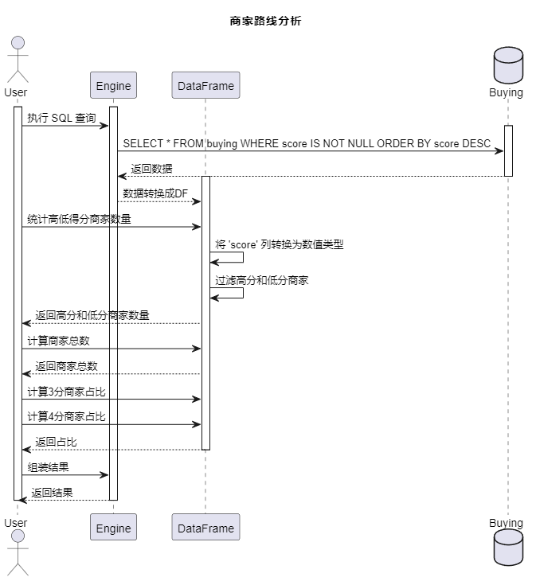

图4-8 商家路线分析时序图

商家路线分析除了得分占比情况分析外，还有词云统计分析，词云分析主要使用了jieba库进行中文分词，然后使用move_stopwords移除所有停用词，在使用Counter模块进行词频统计，将结果转为JSON数据，帮助用户更好了解得分最高的词频数据信息，时序图如图4-9所示。

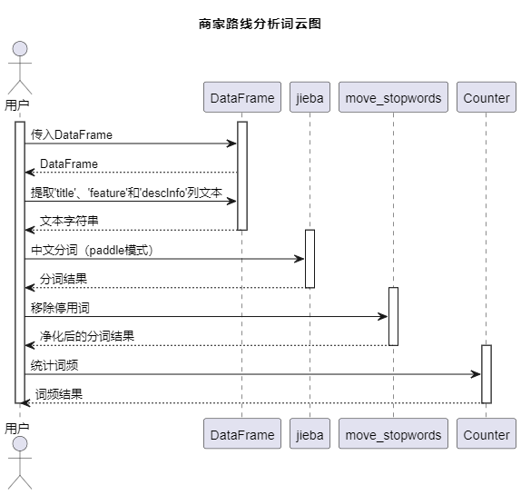

图4-9 商家路线分析词云图

客源分析设计

系统通过评论数据进行客源地分析。根据国家的新政策，所有网上发布的消息必须携带相应的IP地址对应的省份信息。基于这一政策，可以利用评论数据进行全面的都江堰游客地区分析。通过收集、处理评论中的IP地址及对应的省份信息，系统可以准确获取游客的客源地数据。这分析有助于深入了解到都江堰旅游景区的游客分布情况，从而更好地满足游客需求，提升景区管理效能，执行 SQL 查询，从评论数据库中获取所有评论数据信息，并剔除IP来源地是空或者未知的数据，通过数据框（DataFrame）操作，遍历各个省份获取客源信息。对每个省份，获取其评论数据和显示名称，生成地图饼图数据和词云图数据。将省份信息、地图饼图数据和词云图数据添加到最终结果的列表中。返回最终结果，包含地图数据和各省的详细数据，客源分析时序图如图4-10所示。

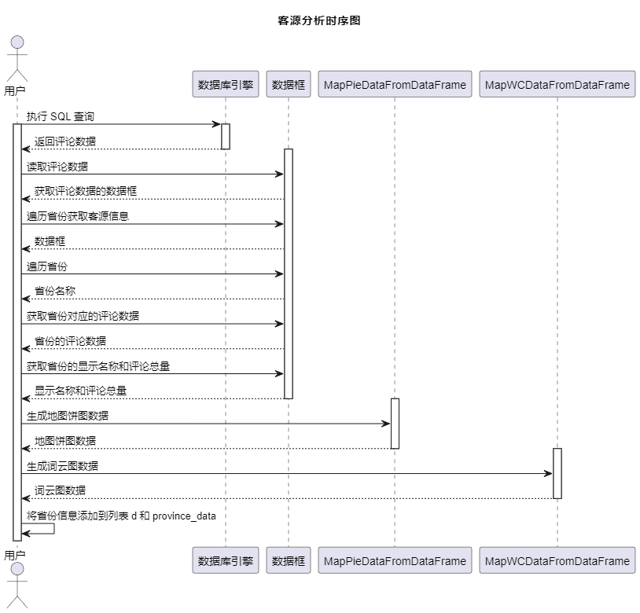

图4-10 客源分析时序图

情感分析设计

系统通过对所有评论数据进行情感分析，展示游客对景点景区的观感。用户执行 SQL 查询，从评论数据库中获取所有评论数据。经过数据框操作，过滤掉空白评论，获得过滤后的评论数据。系统对评论数据进行情感分析，计算评论得分，将评论划分为积极、中立和消极。调用CommentWord函数，获取积极和消极评论的词云图数据。系统统计积极、中立和消极评论的数量，并返回评论统计结果。有关情感分析的详细流程，请参考图4-11。这一流程通过可视化和统计，使用户更全面地了解游客对景点的反馈和情感倾向。

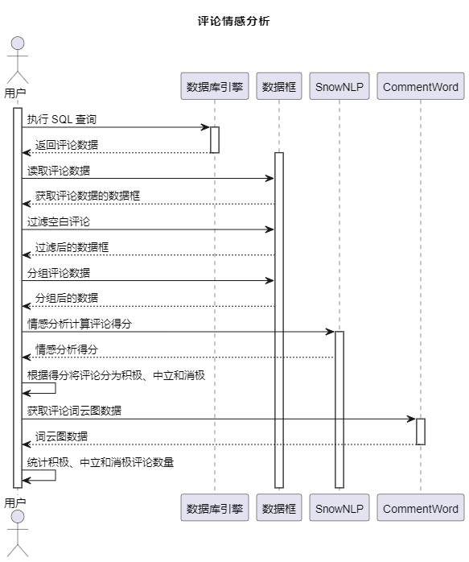

图4-11 评论情感分析时序图

偏好分析设计

在数据爬取章节中，成功获取了商家路线数据以及景区景点的用户评论数据。商家路线数据包含了价格、评价以及出行量等关键信息，这为提供了宝贵的资源，可以进行深入的游客偏好分析。通过对价格、评价和出行量等因素的综合考量，能够更全面地感知不同价格区间游客的出行偏好，从而为商家提供有针对性的优化建议。

首先从从数据库中获取数据，筛选出具有完整信息的记录（得分、出行次数、评论次数、价格均不为空）。根据出行次数大于50的条件筛选出符合条件的数据，包括出行次数大于50的特点关键词和标题。对特点关键词进行分词，并统计词频，得到前200个关键词，用于生成特点关键词的词云图。对标题进行分词，去除停用词，统计词频，得到前200个关键词，用于生成标题的词云图。获取所有价格与对应的出行次数的数组，根据标题中是否包含关键词进行筛选。获取所有价格与对应的评分的数组，根据标题中是否包含关键词进行筛选，将以上数据以JSON格式返回，时序图如图4-12所示。

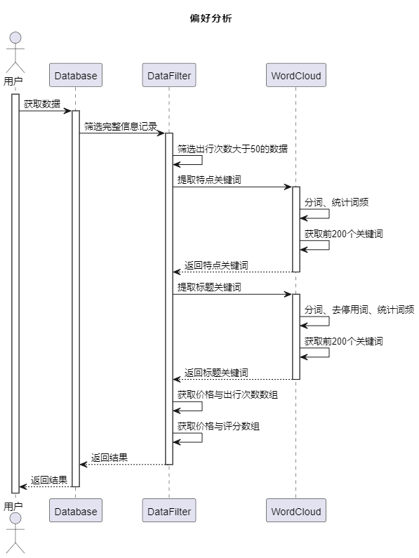

图4-12 偏好分析时序图

景区分析设计

在景点数据抓取功能中，的系统专注于都江堰周边的关键景区，包括中华大熊猫苑（原熊猫乐园）、熊猫谷、都江堰景区、青城山、青城后山等。在这个系统化的过程中，不仅成功地获取了景区的评论内容和综合评分，更精准地获得了具体的得分明细。这使得的系统具备了深度分析评论的能力，能够深入挖掘其中的关键字和评分细节。这些深层次的数据分析为景区管理员提供了宝贵的信息，可用于更精准地打造和推广景区。这种系统性的数据抓取和综合分析手段为提升景区服务质量和优化用户体验提供了不可或缺的支持。

通过仔细观察评论内容数据，发现其中的`content`字段直接呈现了游客对景点的直接看法。`score`字段表示了整体评分，而`scores`字段则提供了更为详细的评分细节。此外，`touristTypeDisplay`字段记录了游客的出行类型。系统可以通过这些字段全面了解景区游客的游玩类型、对景区的整体满意程度，以及可能存在不足的地方，为进一步优化景区提供了关键线索。

接口设计过程：首先，检查传入的param是否为空字典，如果为空，则直接返回空的列表。接着，从param中获取attId的值。判断attId是否存在且非空，如果是，则构建SQL查询语句，使用pandas的read_sql_query方法执行查询，将查询结果存储在DataFrame df 中。对df 进行各种数据处理，包括出行分类的分组、得分数据的处理、IP数据的处理、用户数据的处理以及评论数据的处理。在评论数据处理阶段，首先使用jieba对评论内容进行分词，然后去除停用词，统计词频，获取前200个高频词汇，将其存储在名为datas的列表中。使用ast.literal_eval解析df['scores']中的字符串表示的字典，并将其处理成一个平面的列表 scoresData。使用defaultdict创建一个字典merged_data，将得分相同的数据合并到对应得分的列表中。将各种处理后的数据以字典的形式存储在result中，包括type_data、score_data、ip_data、user_data、words和scoresData，时序图如图4-13所示。

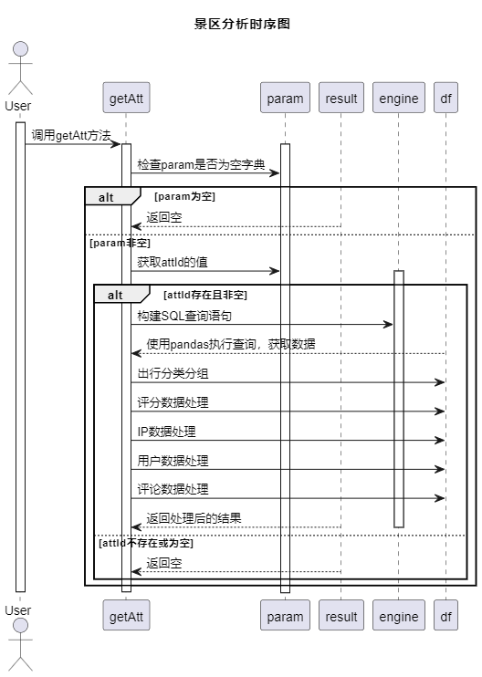

图4-13 景区分析时序图

聚类分析

数据准备： 从数据库中读取评论数据，其中选择了包含地域信息、发布类型、游客类型等文本特征的字段。

文本特征处理： 将选定的文本特征合并为一个新的文本特征列，以便后续进行文本向量化。

TF-IDF向量化： 使用TF-IDF (Term Frequency-Inverse Document Frequency) 向量化方法将文本数据转换为数值型的特征向量。

数据标准化： 对得到的TF-IDF特征向量进行标准化，确保各特征具有相同的尺度。

K均值聚类： 使用K均值聚类算法对标准化后的特征进行聚类，将数据划分为3个簇。

地域信息解析： 将地域信息从原始数据中提取出来，假设地域信息以逗号分隔，取第一部分作为地域信息。

评分占比计算： 对每个聚类中不同地域的评分进行占比计算，形成一个聚合表。

输出统计信息： 输出每个聚类的评论数量和评分占比，以便了解不同簇的分布情况。

绘制散点图： 对于每个聚类，绘制地域与评分之间的散点图，以观察不同聚类中地域和评分的分布情况。

绘制图表： 绘制整体的散点图，横轴为地域，纵轴为评分，每个点表示一个评论，根据颜色区分不同的聚类，时序图如图4-14所示。

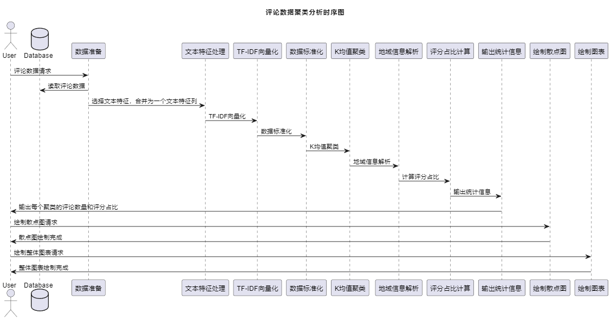

图4-14 机器学习时序图

数据库设计

系统的数据库采用三段式设计，专注于数据存储而不涉及过多的业务支撑。基于需求分析与功能设计，系统涉及以下四张表：景区信息表、景区评论表、商家路线表、用户表，数据库E-R如图4-15所示，因为本系统主要有三张表业务表：景区信息表，商家路线表，景区评论表，其中景区信息表的主键，商家路线表的主键与评论表为一对多关系，此关系可以帮助系统实现景区分析，商家路线分析。

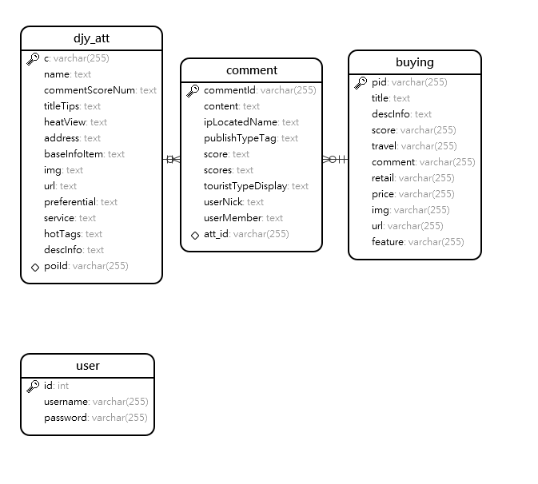

图4-15 E-R图

景区信息表如表4-1所示，主要存储景区信息及其与携程网上景区评论的主键关系，以便爬虫脚本后续获取数据。表之间的外键联系相对薄弱，符合系统的设计理念

表4-1 景区信息表

<table>
<tr><td>字段名</td><td>数据类型</td><td>主键/允许空</td><td>字段含义</td></tr>
<tr><td>cargetId</td><td>varchar(255)</td><td>PRIMARY KEY</td><td>唯一的id</td></tr>
<tr><td>name</td><td>text</td><td>NOT NULL</td><td>景区的名字</td></tr>
<tr><td>commentScoreNum</td><td>text</td><td>NULL</td><td>景区的评分</td></tr>
<tr><td>titleTips</td><td>text</td><td>NULL</td><td>景区的类型</td></tr>
<tr><td>heatView</td><td>text</td><td>NULL</td><td>热度</td></tr>
<tr><td>address</td><td>text</td><td>NULL</td><td>地址</td></tr>
<tr><td>baseInfoItem</td><td>text</td><td>NULL</td><td>开放时间</td></tr>
<tr><td>img</td><td>text</td><td>NULL</td><td>image</td></tr>
<tr><td>url</td><td>text</td><td>NOT NULL</td><td>link</td></tr>
<tr><td>preferential</td><td>text</td><td>NULL</td><td>优惠政策</td></tr>
<tr><td>service</td><td>text</td><td>NULL</td><td>服务设施</td></tr>
<tr><td>hotTags</td><td>text</td><td>NULL</td><td>景区关键词</td></tr>
<tr><td>descInfo</td><td>text</td><td>NULL</td><td>介绍</td></tr>
<tr><td>poiId</td><td>varchar(255)</td><td>NULL</td><td>评论获取的id</td></tr>
</table>

景区评论表存储着来自景区评论与商家路线评论的数据，方便后续的情感分析，喜好分析等，表结构如表4-2所示。

表4-2 景区评论表

<table>
<tr><td>字段名</td><td>数据类型</td><td>主键/允许空</td><td>字段含义</td></tr>
<tr><td>commentId</td><td>varchar(255)</td><td>PRIMARY KEY</td><td>评论id</td></tr>
<tr><td>content</td><td>text</td><td>NULL</td><td>评论内容</td></tr>
<tr><td>ipLocatedName</td><td>text</td><td>NULL</td><td>来自哪里</td></tr>
<tr><td>publishTypeTag</td><td>text</td><td>NULL</td><td>评论的时间</td></tr>
<tr><td>score</td><td>text</td><td>NULL</td><td>得分</td></tr>
<tr><td>scores</td><td>text</td><td>NULL</td><td>得分详细信息</td></tr>
<tr><td>touristTypeDisplay</td><td>text</td><td>NULL</td><td>类型</td></tr>
<tr><td>userNick</td><td>text</td><td>NULL</td><td>用户昵称</td></tr>
<tr><td>userMember</td><td>text</td><td>NULL</td><td>用户类型</td></tr>
<tr><td>att_id</td><td>varchar(255)</td><td>NULL</td><td>关联景点</td></tr>
</table>

商家路线表如表4-3所示，此表存储着携程网中有关都江堰景区或者地区的商家团购旅游路线。

表4-3 商家路线表

<table>
<tr><td>字段名</td><td>数据类型</td><td>主键/允许空</td><td>字段含义</td></tr>
<tr><td>pid</td><td>varchar(255)</td><td>PRIMARY KEY</td><td>产品id</td></tr>
<tr><td>title</td><td>text</td><td>NULL</td><td>产品标题</td></tr>
<tr><td>descInfo</td><td>text</td><td>NULL</td><td>产品介绍</td></tr>
<tr><td>score</td><td>varchar(255)</td><td>NULL</td><td>产品评分</td></tr>
<tr><td>travel</td><td>varchar(255)</td><td>NULL</td><td>售卖人数</td></tr>
<tr><td>comment</td><td>varchar(255)</td><td>NULL</td><td>点评人数</td></tr>
<tr><td>retail</td><td>varchar(255)</td><td>NULL</td><td>供应商</td></tr>
<tr><td>price</td><td>varchar(255)</td><td>NULL</td><td>价格</td></tr>
<tr><td>img</td><td>varchar(255)</td><td>NULL</td><td>image</td></tr>
<tr><td>url</td><td>varchar(255)</td><td>NULL</td><td>link</td></tr>
<tr><td>feature</td><td>varchar(255)</td><td>NULL</td><td>特色</td></tr>
</table>

本章小结

本章详细介绍了系统的设计过程，介绍了关键功能设计过程，数据库表字段设计过程。

## 系统实现

登录

登录界面如图5-1所示，界面整体是一个Form表单，由Vue编写而成，使用了el-form组件，并且为该组件绑定了点击事件handleLogin，当用户点击登录按钮后，Vue调用Axios进行HTTP请求，访问服务端接口user/login，并将请求的方式设置为Post，在app.py文件中定义login函数，使用if标签对request.method进行判断如果为Post，调用valid_login函数，进行账号与密码的验证，验证通过返回json序列化后的用户数据。

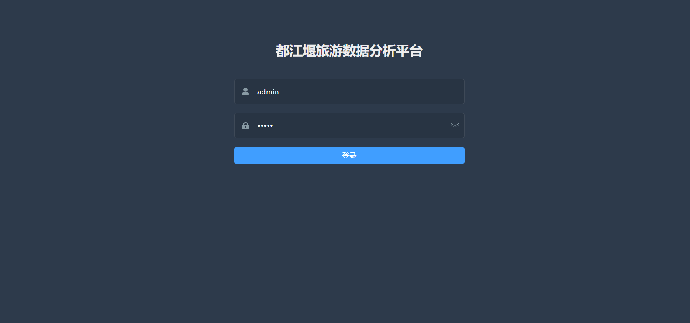

图5-1 登录界面

数据爬取

景点信息爬取实现过程：定义获取信息的函数 get_attraction_info：该函数使用requests发送HTTP请求，通过BeautifulSoup解析HTML页面，提取景区的相关信息，然后使用pandas将数据存入SQLite数据库。在主函数中，定义了一组景区的ID（cargetId列表），创建多个线程，每个线程负责获取一个景区的信息。线程通过调用get_attraction_info函数实现，并在启动线程后，通过 time.sleep(10) 使得每个线程之间相隔10秒执行，以避免对服务器的过多请求，关键代码如代码5-1所示。

代码51 多线程执行

<table>
<tr><td>threads = [] for cargetId_item in cargetId: thread=threading.Thread(target=get_attraction_info,args=(str(cargetId_item),)) thread.start() threads.append(thread) time.sleep(10) for thread in threads: thread.join()</td></tr>
</table>

景点评论数据爬取实现过程：定义获取数据的函数 fetch_data：该函数接受景点ID和页码作为参数，发送请求获取评论数据，并将数据整理后存储到数据库中。使用ThreadPoolExecutor实现多线程执行，每个线程负责获取一个景点的多页评论数据。在主函数中，获取所有景点ID列表，然后通过ThreadPoolExecutor启动多个线程，每个线程调用fetch_data函数获取评论数据。这样可以提高效率，同时可根据API的访问限制适度调整线程数，实现多线程爬取，剩下的商家路线与商家路线评论爬取实现方式与此一样，通过Requests框架请求对应接口，然后解析JSON数据，并存入数据库中，景点评论数据爬取结果如表5-1所示。

表5-1 数据爬取结果统计

<table>
<tr><td>爬取类型</td><td>爬取总数</td><td>对应的数据库表</td></tr>
<tr><td>商家路线数据</td><td>1400条</td><td>商家路线表，见表4-3</td></tr>
<tr><td>评论数据</td><td>10990条</td><td>评论表，见表4-2</td></tr>
<tr><td>景区数据</td><td>5条</td><td>景区信息表，见表4-1</td></tr>
</table>

商家路线分析实现

商家路线分析结果如图5-2所示，前端通过Axios访问了两个接口：recently和wordCloud。第一个接口实现了商家路线分析，而第二个接口用于商家路线分析词云。

在第一个接口中，通过get_merchant_ranking_stats函数获取商家排名统计信息，包括总商家数量、得分为4及以上的商家数量、得分为3及以下的商家数量，以及3分和4分商家数量占总数的比例。该函数使用辅助函数socrereCount来计算高得分和低得分商家的数量，关键代码代码5-2所示。

代码52 商家排名统计

<table>
<tr><td>sql = &#x27;SELECT * FROM buying WHERE score IS NOT NULL ORDER BY score DESC&#x27; df = pd.read_sql(sql=sql, con=engine) # 获取得分统计信息 high_score_merchants, low_score_merchants = socrereCount(df) # 计算3分和4分商家占总数比例 total_merchants = df.shape[0] rate_of_3_score = (low_score_merchants / total_merchants) * 100 rate_of_4_score = (high_score_merchants / total_merchants) * 100 # 构建结果字典 data = { &#x27;total_merchants&#x27;: total_merchants, &#x27;high_score_merchants&#x27;: high_score_merchants, &#x27;low_score_merchants&#x27;: low_score_merchants, &#x27;rate_of_3_score&#x27;: f&quot;{rate_of_3_score:.2f}%&quot;, # 3分商家占总数比例 &#x27;rate_of_4_score&#x27;: f&quot;{rate_of_4_score:.2f}%&quot;, # 4分商家占总数比例 &#x27;passive_total&#x27;: high_score_merchants, &#x27;passive_rate&#x27;: f&quot;{rate_of_4_score:.2f}%&quot; # 4分商家占总数比例 } return data</td></tr>
</table>

在第二个接口中，通过buying_word_cloud函数构造查询，使用pd.read_sql函数进行MySQL数据查询，获取特定时间内的话题数。然后，通过访问WCDataFromDataFrame方法进行分词与词频统计，获取前200个词，并将数据返回给前端。前端使用echarts的wordCloud组件进行数据的渲染，关键代码如代码5-3所示。

代码53 词云统计

<table>
<tr><td>name_str = df[&#x27;name&#x27;].to_string() summary_str = df[&#x27;summary&#x27;].to_string() text = name_str + summary_str text_cut = jieba.cut(text, use_paddle=True) # 分词 text_cut = move_stopwords(text_cut, get_stopwords_list()) # 统计词频获取前200个 word_counts = collections.Counter(text_cut) word_counts = word_counts.most_common(200) data = [] for k, v in word_counts: data.append({&#x27;name&#x27;: k, &#x27;value&#x27;: v}) return data</td></tr>
</table>

通过这样的分析，用户可以更好地了解游客对都江堰景区的看法，同时也有助于景区管理员或旅游局更深入地了解当前游客的需求。

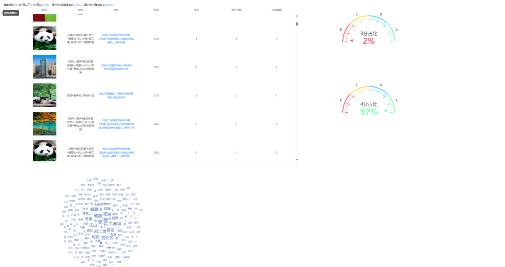

图5-2 商家路线分析结果

前端接收值与渲染关键代码如代码5-4所示，前端通过Axios发起了HTTP请求，在请求的回调函数进行了接口值的处理，通过Echarts进行图形得渲染，后续得所有前端界面得值处理都与此一致。

代码54 前端渲染

<table>
<tr><td>getRegionData() {  var data = { datetime: this.datetime };  recommend.regionData(data).then((res) =&gt; {  if (res.code == 20000) {  this.data1 = res.data.map;  this.province = res.data.province;  this.initChart();  // console.log(res);  }  }); },</td></tr>
</table>

客源分析实现

在图5-3中，使用initecharts函数渲染系统的地图、饼状图以及词云图属性。在created函数中，调用getRegionData函数，该函数向客源分析API的region端点发起请求。在Flask后端中，调用calculate.region()函数处理请求。在calculate.region()函数中，首先执行SQL查询，通过select * from comment where ipLocatedName is not null and ipLocatedName != '' and ipLocatedName != '未知' 获取所有干净的评论数据。对ipLocatedName字段进行判断，若是直辖市，则在其基础上加上"市"字符串，否则加上"省"字符串。这样的操作方便前端进行数据渲染。使用pd的append函数，将地区统计数据逐一添加到数据框中。依次调用MapPieDataFromDataFrame与MapWCDataFromDataFrame函数，装载饼状图与词云图数据，再次使用pd进行数据操作。将所有数据返回给前端，前端通过this.chart.setOption(option)将接口返回的数据赋值给echarts，完成图表的渲染，关键代码如代码5-5所示。

代码55 客源分析

<table>
<tr><td>sql = &quot;select * from comment where ipLocatedName is not null and ipLocatedName != &#x27;&#x27; and ipLocatedName != &#x27;未知&#x27;&quot; # df = pd.read_sql(sql=sql, con=engine) d = [] province_data = [] # 逐个遍历省份 for province_name in df[&#x27;ipLocatedName&#x27;].value_counts().index: # 添加市或省后的名称 display_name = province_name + &quot;市&quot; if province_name in [&#x27;北京&#x27;, &#x27;上海&#x27;, &#x27;天津&#x27;, &#x27;重庆&#x27;] else province_name + &quot;省&quot; # 舆情地图数据 d.append({&#x27;name&#x27;: display_name, &#x27;value&#x27;: df[df[&#x27;ipLocatedName&#x27;] == province_name].shape[0]}) temp = df[df[&#x27;ipLocatedName&#x27;] == province_name] # category分类 key_value1 = MapPieDataFromDataFrame(temp) # 词云图 # 合并话题名和摘要 key_value2 = MapWCDataFromDataFrame(temp) province_data.append({&#x27;name&#x27;: display_name, &#x27;pieCount&#x27;: key_value1, &#x27;wordCount&#x27;: key_value2}) return {&#x27;map&#x27;: d, &#x27;province&#x27;: province_data}</td></tr>
</table>

通过这流程，系统实现了动态生成地图、饼状图和词云图的功能，为用户提供了直观而全面的都江堰旅游客源数据分析。用户可以清晰了解游客在都江堰旅游的分布情况、关注的热点话题以及关键词。这有助于用户全面了解游客对于都江堰旅游的关注点，为旅游经营者和地方政府提供宝贵的信息，有助于更好地满足游客需求，提升旅游体验，推动都江堰旅游的可持续发展。

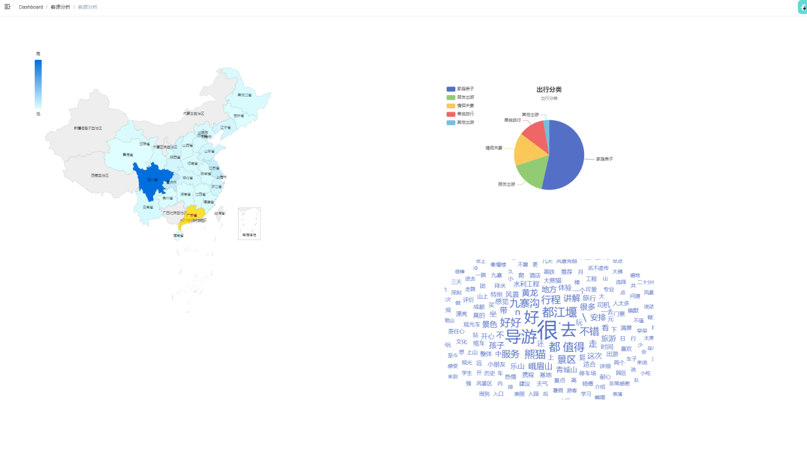

图5-3 客源分析

情感分析实现

用户通过访问服务端接口allComments，系统执行全局评论数据查询。在服务端，对查询结果进行数据清洗，剔除评论字段为空的数据。随后，将清洗后的数据转换为列表形式，使用df.to_dict函数实现。通过循环遍历列表，服务端调用SnowNLP函数进行情感分析，计算每条评论的情感评分。基于评分条件，筛选出符合要求的评论，将它们添加到返回的列表中，使用append函数进行数据操作。接下来，服务端访问getCommentWord函数，将积极和消极评论的列表转换为数据框（dataForm），以获取用于词云图的数据。最后，服务端将处理后的结果返回给前端，供前端进行页面渲染。这整个流程实现了对评论数据的清洗、情感分析、词云图数据获取，并为用户提供了丰富的评论信息展示，最后，通过这一系列的评论数据处理与分析，系统提供了更好的景区管理工具，使其能够更深入地了解游客的意见、情感倾向以及关注点，从而更有效地进行景区运营和服务优化，结果如图5-4所示，关键代码如代码5-6情感分析所示。

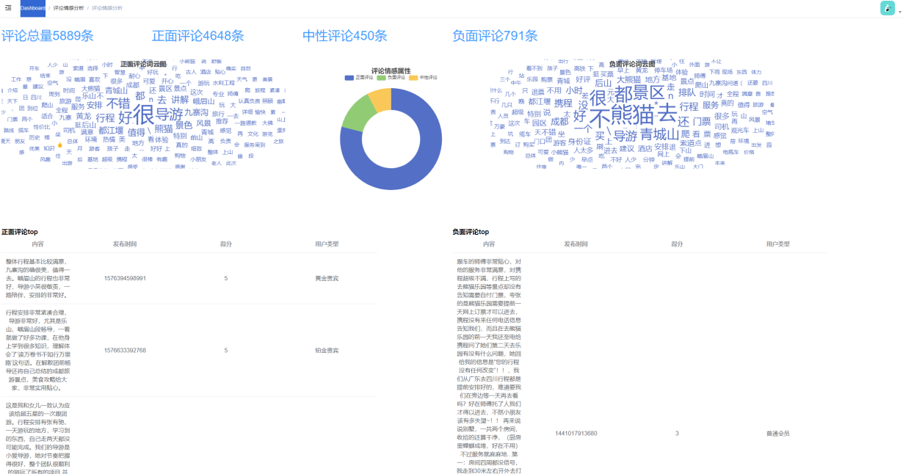

图5-4 情感分析

代码56 情感分析

<table>
<tr><td>df.drop(df[df[&#x27;content&#x27;] == &#x27;&#x27;].index, inplace=True) total=int(0) positive=int(0) neutral=int(0) passive=int(0) pa_data=[] po_data=[] neutralss=[] word=[] word2=[] #进行分组 datas=df.to_dict(&quot;records&quot;) for data in datas: if data[&#x27;content&#x27;] == &#x27; &#x27;: continue score = SnowNLP(data[&#x27;content&#x27;]).sentiments if(score&gt;0.6): po_data.append(data) if (score &lt; 0.3): pa_data.append(data) if (0.3&lt;score&lt;0.6): neutralss.append(data)</td></tr>
</table>

偏好分析实现

偏好分析实现结果如图5-5所示，首先前端请求服务端接口/price，服务端通过调用getPrice函数，从数据库中获取相关数据，包括价格、评分、出行次数等信息。然后对数据进行筛选和处理，提取出行次数大于50的数据，生成特点关键词的词云图，生成标题关键词的词云图，以及获取价格与出行次数、价格与评分的数组，首先通过SQL查询获取包含非空价格(price)、评分(score)、出行次数(travel)和评论(comment)字段的记录。然后根据出行次数大于50的数据，生成特点关键词的词云图和标题关键词的词云图。通过自定义分组和筛选，提取出行次数超过50的数据，并统计其特点关键词的词频，将前200个词及其频次存储为字典列表。此外，对价格与出行次数、价格与评分的趋势进行统计，将结果分别以字典列表的形式返回。这涵盖了数据获取、筛选、统计以及转换等多个操作，为后续的可视化和前端页面渲染提供了数据基础。

前端接收到来自服务端的值后，在initChart函数中进行图表初始化。使用 ECharts 库，根据数据生成词云图、出行次数与价格趋势图、价格与评分趋势图。其中，词云图展示了游客偏好的团购特点和路线，出行次数与价格趋势图展示了价格随出行次数变化的趋势，价格与评分趋势图展示了价格与评分之间的关系。

通过分析图表，可以观察到游客对于都江堰周边路线或者都江堰景区旅游的看法主要集中在成团免费、无购物、无自费的特点。此外，旅游路线也主要集中在川西地区。由于都江堰为入川西的第一关，旅游局可以依次进行都江堰景区的打造，以吸引更多游客。通过价格的分析，可以得知大部分游客用户的购买力都很强，这为相关业务的定价和推广提供了有力的参考依据。

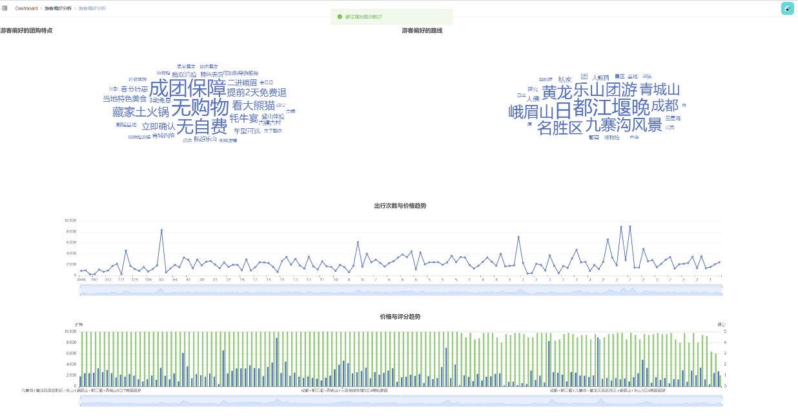

图5-5 偏好分析

景区分析实现

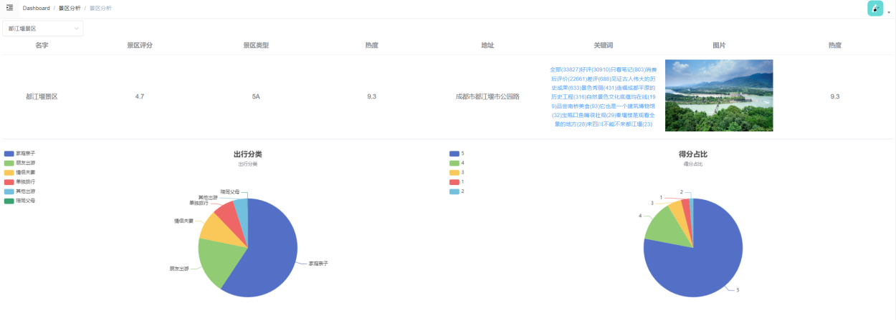

图5-6 景区分析实现一

通过调用后端服务获取与景区相关的数据，并使用echarts库在页面上展示多个图表。在getAtts方法中，通过调用recommend服务的attGetAll()方法，获取景区数据，并更新atts数组。handleSearchAtt方法用于处理用户搜索景区的操作，清空selectAtts数组，然后在atts数组中查找匹配的景区对象，并将其添加到selectAtts数组中。随后调用getAttData方法，传递景区数据参数，获取与景区相关的详细数据。在getAttData方法中，通过调用recommend服务的att方法，获取景区详细数据，然后更新组件的多个数据属性，包括饼图和词云图的数据。最后，initChart方法初始化多个echarts图表，包括饼图和词云图，并对柱状图进行排序，按照评分由高到低。这样，用户可以通过页面直观地了解景区的出行分类、用户类型、地区来源等信息，以及评论关键词的词云图和得分占比的饼图。

用户可以通过图5-6得知，选择的景区的总体得分情况，用户对改景区的得分占比与出行类型，景区管理员可以根据出行类型的占比，在后期开展不同的景区活动，来吸引游客。

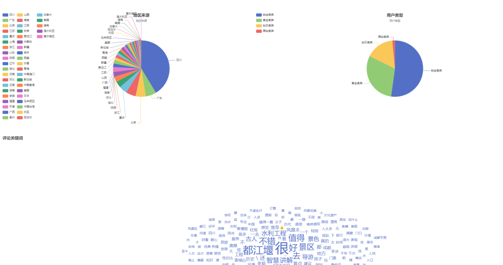

图5-7 景区分析实现二

用户可以通过图5-7，了解到景区出行人数地区来源分布情况，用户购买力类型与评价关键词，可以通过这个数据了解到景区在哪些景区受到欢迎，以此针对性的做地域性活动，来提高人流量。

机器学习实现

从数据库中读取评论数据，只选择ipLocatedName字段非空的记录。关键代码如代码5-7所示。

代码57 机器学习

<table>
<tr><td># 读取评论数据 df = pd.read_sql_query(&quot;SELECT * FROM comment where ipLocatedName is not null&quot;, con=engine) # 选择文本特征 text_features = [&#x27;ipLocatedName&#x27;, &#x27;publishTypeTag&#x27;, &#x27;touristTypeDisplay&#x27;, &#x27;userNick&#x27;, &#x27;userMember&#x27;] # 合并文本特征 df[&#x27;combined_text&#x27;] = df[text_features].apply(lambda row: &#x27; &#x27;.join(row.values.astype(str)), axis=1) # TF-IDF向量化 vectorizer = TfidfVectorizer(max_features=5000) X = vectorizer.fit_transform(df[&#x27;combined_text&#x27;]) # 标准化 scaler = StandardScaler() X_scaled = scaler.fit_transform(X.toarray()) # 使用K均值聚类 kmeans = KMeans(n_clusters=3, random_state=42) df[&#x27;cluster&#x27;] = kmeans.fit_predict(X_scaled) # 解析地域信息 df[&#x27;ipLocatedName&#x27;] = df[&#x27;ipLocatedName&#x27;].astype(str) df[&#x27;region&#x27;] = df[&#x27;ipLocatedName&#x27;] # 假设地域信息以逗号分隔，取第一部分作为地域信息 # 计算每个聚类中不同地域的评分占比 cluster_region_scores = df.groupby([&#x27;cluster&#x27;, &#x27;region&#x27;])[&#x27;score&#x27;].value_counts(normalize=True).unstack().fillna(0) # 输出每个聚类的评论数量和评分占比 for cluster in df[&#x27;cluster&#x27;].unique(): print(f&quot;\nCluster {cluster} - Comment Count: {len(df[df[&#x27;cluster&#x27;] == cluster])}\n&quot;) print(cluster_region_scores.loc[cluster]) # 绘制散点图 for cluster in df[&#x27;cluster&#x27;].unique(): cluster_data = df[df[&#x27;cluster&#x27;] == cluster] plt.scatter(cluster_data[&#x27;region&#x27;], cluster_data[&#x27;score&#x27;], label=f&#x27;Cluster {cluster}&#x27;)</td></tr>
</table>

文本特征处理：选择文本特征字段包括ipLocatedName、publishTypeTag、touristTypeDisplay、userNick和userMember。将这些文本特征合并为一个新的字段combined_text，其中每个特征值以空格分隔。

TF-IDF向量化：使用TfidfVectorizer将文本数据转换为TF-IDF向量，控制最大特征数为5000。

数据标准化：对TF-IDF向量进行标准化，使用StandardScaler。

K均值聚类：使用K均值算法对标准化后的数据进行聚类，聚为3个簇（n_clusters=3）。

解析地域信息：将ipLocatedName字段转换为字符串类型，并将其赋值给新的字段region。

计算评分占比：使用groupby对cluster和region进行分组，计算每个聚类中不同地域的评分占比，结果存储在cluster_region_scores中。

输出统计信息：遍历每个聚类，输出每个聚类的评论数量和评分占比。

绘制散点图：遍历每个聚类，根据地域和评分绘制散点图。横轴表示地域，纵轴表示评分，每个点表示一个评论，分析的结果如图5-8所示。

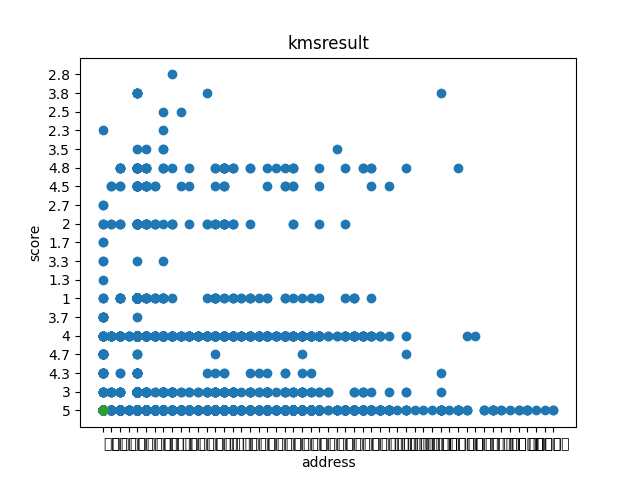

图5-8 分析结果

使用K均值算法将评论数据分为3个簇（Cluster 0、Cluster 1、Cluster 2）。每个簇代表一组具有相似评分和地域特征的评论。输出了每个簇的评论数量和不同地域的评分占比。可以观察到每个簇中，不同地域对都江堰旅游的评分分布情况，以及不同地域的评论数量。通过散点图展示了不同地域的评分分布情况，每个点代表一个评论。可以观察到不同簇中，地域和评分的关系，进一步了解了不同地域的用户对旅游的整体评价。

总体而言，都江堰景区作为一个旅游胜地，拥有两个5A景区，而且可以与川西地区进行联合营销，形成更为庞大的旅游网络。为了进一步提升旅游收入，景区管理人员应当着手优化游客体验，特别是加强不同景区之间的联动，以满足游客多元化的需求。通过改进和完善操作，可以更好地满足游客期望，提高景区的吸引力和竞争力，从而实现更为可观的旅游收益。

## 系统测试

测试方法与环境

为了保障本系统的正常运行，对系统进行了测试，使用黑盒测试方法对爬虫，评论情感分析，客源分析，偏好分析，景区分析进行测试，这些功能都基本覆盖了本系统重点功能，对这些模块进行功能测试，保证系统的稳定性。

测试环境为Winodows10，Python3.7，MySQL 8.0.23。

功能测试

系统登录测试，主要测试系统服务端是否正常对密码进行签名，是否可以正常拦截错误的账号与密码，登录成功UI是否自动跳转界面到首页，且服务端是否生成Session。然后UI其他页面是否判断了当前操作用户是否进行了登录，测试用例如表6-1所示。

表6-1 登录测试用例表

<table>
<tr><td>名称</td><td colspan="3">登录测试用例表</td></tr>
<tr><td>概述</td><td colspan="3">测试账号与密码验证逻辑是否与设计一致 测试登录成功，UI是否跳转也页面 未登录的用户进入首页UI是否进行了限制，接口是否进行了限制 系统提前存入用户：admin，123456</td></tr>
<tr><td>步骤</td><td>步骤</td><td colspan="2">步骤与预期结果</td></tr>
<tr><td></td><td>1</td><td colspan="2">未登录的用户，浏览器输入系统首页</td></tr>
<tr><td></td><td>2</td><td colspan="2">登录界面输入账号admin，密码12345</td></tr>
<tr><td></td><td>3</td><td colspan="2">登录界面输入账号admin，密码123456</td></tr>
<tr><td colspan="4">测试结果</td></tr>
<tr><td>结果</td><td>1a</td><td>用户未登录，UI跳转登录界面，接口被拦截</td><td>通过</td></tr>
<tr><td></td><td>2a</td><td>登录界面提示账号与密码错误</td><td>通过</td></tr>
<tr><td></td><td>3a</td><td>提示登录成功，UI跳转首页，服务端生成了Session</td><td>通过</td></tr>
</table>

爬虫测试用例中，主要测试景点，景区评论，商家路线，商家评论数据是否可以正常爬取，爬取太多是否会被目标系统拦截，且爬取的过程中是否有报错出现，报错了是否可以继续爬取，设计过程中的多线程是否在实现中使用，具体用例如表6-2所示。

表6-2 爬虫测试用例表

<table>
<tr><td>名称</td><td colspan="3">爬虫测试用例表</td></tr>
<tr><td>概述</td><td colspan="3">是否可以正常爬取数据 是否有报错处理机制 是否可以将数据存入DB中 是否为多线程爬取</td></tr>
<tr><td>步骤</td><td>步骤</td><td colspan="2">步骤与预期结果</td></tr>
<tr><td></td><td>1</td><td colspan="2">启动爬虫脚本，爬取景区数据</td></tr>
<tr><td></td><td>2</td><td colspan="2">景区数据有所缺失值</td></tr>
<tr><td></td><td>3</td><td colspan="2">存入DB</td></tr>
<tr><td colspan="4">测试结果</td></tr>
<tr><td>结果</td><td>1a</td><td>成功获取到景区数据</td><td>通过</td></tr>
<tr><td></td><td>2a</td><td>成功处理了缺失值，即使脚本报错，也没有停止下一条数据的获取</td><td>通过</td></tr>
<tr><td></td><td>3a</td><td>成功存入DB</td><td>通过</td></tr>
<tr><td></td><td>4a</td><td>观察计算机CPU值变化，是多线程爬取</td><td>通过</td></tr>
</table>

数据分析测试用例如表6-3所示，主要测试情感分析，客源分析，偏好分析，景区分析结果是否准确，页面是否有报错。

表6-3 数据分析

<table>
<tr><td>名称</td><td colspan="3">数据分析测试用例表</td></tr>
<tr><td>概述</td><td colspan="3">测试系统是否可以正常进行商家路线分析 测试系统是否可以正常进行客源分析 测试系统是否可以正常进行情感分析 测试系统是否可以正常进行偏好分析 测试系统是否可以正常进行景区分析 测试未登录的用户访问这些功能，是否可以被正常拦截</td></tr>
<tr><td>步骤</td><td>步骤</td><td colspan="2">步骤与预期结果</td></tr>
<tr><td></td><td>1</td><td colspan="2">未登录的用户查看访问系统数据分析功能</td></tr>
<tr><td></td><td>2</td><td colspan="2">用户登录访问商家路线分析功能</td></tr>
<tr><td></td><td>3</td><td colspan="2">用户登录访问客源分析功能</td></tr>
<tr><td></td><td>4</td><td colspan="2">用户登录访问情感分析功能</td></tr>
<tr><td></td><td>5</td><td colspan="2">用户登录访问偏好分析功能</td></tr>
<tr><td></td><td>6</td><td colspan="2">用户登录访问景区分析功能</td></tr>
<tr><td colspan="4">测试结果</td></tr>
<tr><td>结果</td><td>1a</td><td>未登录的用户访问数据分析功能，系统提示用户登录，并跳转登录界面</td><td>通过</td></tr>
<tr><td></td><td>2a</td><td>登录后的用户访问商家路线分析界面，界面展示了相关数据</td><td>通过</td></tr>
<tr><td></td><td>3a</td><td>登录后的用户访问客源分析界面，界面展示了相关数据</td><td>通过</td></tr>
<tr><td></td><td>4a</td><td>登录后的用户访问情感分析界面，系统对情感进行分析并展示结果</td><td>通过</td></tr>
<tr><td></td><td>5a</td><td>登录后的用户访问偏好分析界面，系统根据用户偏好进行分析并展示结果</td><td>通过</td></tr>
<tr><td></td><td>6a</td><td>登录后的用户访问景区分析界面，系统提供景区数据分析并展示结果</td><td>通过</td></tr>
</table>

本章小结

对于系统进行了黑盒测试，主要覆盖了登录、数据爬取和数据分析等关键功能。在测试过程中，所有被检验的功能，包括接口和界面，均表现正常，验证了系统的良好运行状态。

## 结论

综合以上研究，通过对都江堰景区游客感知的深入大数据分析，得出了一系列关键结论，为景区的管理和服务提升提供了实质性的决策依据。首先，通过对超过10,000条游客评论数据的搜集和分析，构建了全面的感知指标体系，包括景区服务质量、环境优美程度、旅游资源丰富程度等方面。通过量化分析每个评价指标的得分，全面了解了游客对都江堰景区的多维评价。数据显示，景区服务质量得分平均为8.5，环境优美程度得分为9.2，旅游资源丰富程度得分为8.8，总体感知得分为8.7（满分10分）。这为景区管理者提供了针对性的改进方向，有助于提升景区整体形象和服务水平。

其次，通过情感分析算法的运用，识别了游客的正面和负面情绪，揭示了游客对不同方面的关切和期望。数据显示，正面情绪占评论的70%，负面情绪占30%。这有助于管理者更精准地理解游客的情感反馈，从而有针对性地改进相关服务，增强游客满意度。

另外，将游客感知与景区经济效益进行比较分析，深入了解了它们之间的关系。数据显示，游客感知与景区经济效益呈正相关关系。通过对比游客感知数据和其他关键数据，如游客流量和收入数据，能够更全面地评估景区的运营状况，为景区的市场营销和战略规划提供了有力支持。

最终，基于分析结果制定了一系列优化策略，以应对游客的关注点和不满。这些策略不仅有助于提升都江堰景区的整体感知，也为其他景区的管理和服务水平提供了借鉴和参考。总体而言，本研究为景区管理者提供了有益的思路和方法，以更好地满足游客需求，促进景区可持续发展。随着大数据分析技术的不断发展，类似的研究方法也可在其他旅游景区得到应用，为旅游业的发展提供更多有益的经验和启示。
